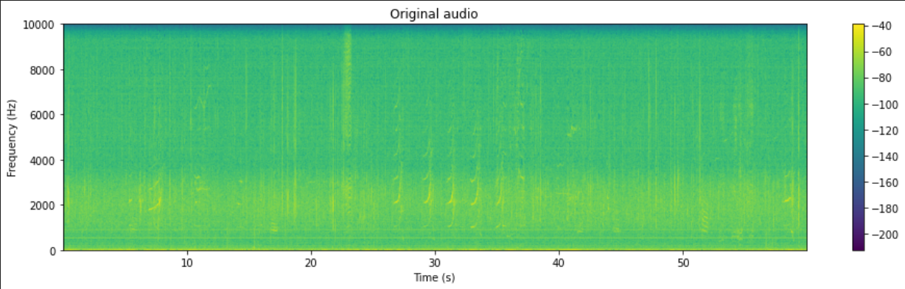
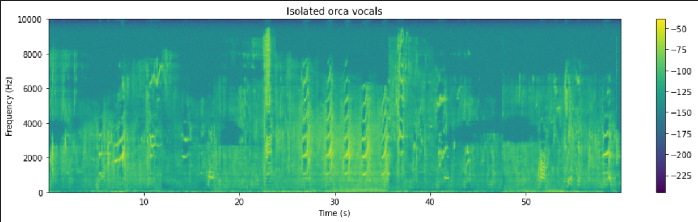

# Bioacoustic Source Separator
This repository contains a GUI that can be used to preprocess and denoise hydrophone recordings, and to isolate orca vocalizations from them. Currently the filters can be applied only in the frequency domain. The denoising filters that are currently available to use are-
*	Moving average filter (with steps of 100 Hz, accounting for a delay of half step)
*	Moving weighted average filters (binomial and exponential weighting)
*	Cubic-Weighted Savitzky-Golay
*	Quartic-Weighted Savitzky-Golay
*	Quintic-Weighted Savitzky-Golay
*	Median filter (fitted with polynomial of degrees 2, 10, 12)
*	Hampel filter

A detailed analysis of Fourier Transforms techniques for underwater denoising can be found [here](https://www.orcasound.net/2022/08/08/orca-calls-analysis-for-acoustic-separation-from-ambra/).

The user can upload 1 or multiple mp3 or wav files, using the button ‘Choose file from directory’. Then plot the Welch’s power spectral density plot of the original audio (if only 1 sound is uploaded) with 'Plot'. After that, the user can choose the filtering technique, and download the filtered audio using the ‘Download’ button. For isolating orca vocals the user can choose one of the models available and download the isolated audio using the ‘Download’ button.

## Separation Models-
1.	Spleeter-
One can use the fine-tuned 2stems spleeter model to separate orca vocalizations from the audio. They can create an instance of the ‘Separator’ object defined in the Python file- ‘spleeter_separator.py’ which takes the location of the json file containing model paramters, and the path to directory containing the model checkpoint as arguments. One of its member functions, ‘return_source_directory’ can be called which returns a dictionary containing names of the sources and waveforms as numpy arrays corresponding to those sources. This function takes the waveform (numpy array) and sample rate as arguments.
The fine-tuned model can be accessed from [here](https://drive.google.com/drive/u/3/folders/1dQFwODO-pIYMax55gq7q6OKtlDkeN5Rz).
You can try out the fine-tuned spleeter model on [Google colab](https://colab.research.google.com/drive/1ijn3lBymWftxfWMEjGimgiG1r89XFm2x?authuser=3#scrollTo=j2ISw4z3ZDge) without installing anything on your system.

2.	Zeroshot Source separator-
The zeroshot audio source separator was also tested but it was outperformed by the Spleeter model. One can also use the Zeroshot model to separate orca vocals. One can use the ‘instance’ function defined in the Python file- ‘zeroshot/instance.py’ which takes the path to the pre-trained zeroshot model checkpoint, and the pre-trained htsat model checkpoint. It also returns a dictionary same as the Spleeter model.
The checkpoints for the zeroshot and the htsat models can be accessed from [here](https://drive.google.com/drive/folders/1RouwHsGsMs8n3l_jF8XifWtbPzur_YQS).

## Dataset used-
The dataset used to train the model was extracted from al the PodCast rounds. Multiple orca vocals were extracted from the dataset and then randomly overlapped with noises from ships, boats and sea waves for data augmentation.
